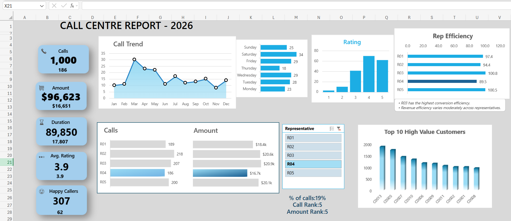

# 📞 Call Centre Operations & Workforce Telemetry Dashboard

## 🏢 Business Problem & Operational Objective
The goal of this project was to transform 1,000 raw, unorganized call records into a single-pane executive dashboard for the year 2026. The business needed to solve two primary operational friction points:
1. **Resource Allocation & Representative Efficiency:** Identifying which customer support representatives are handling the bulk of the volume and who requires targeted satisfaction training.
2. **Customer Lifetime Value Segmentation:** Isolating high-value accounts from high-maintenance "time-wasters" to optimize corporate account management.

---

## 📈 Key Performance Indicators (KPIs) Engineered

The system tracks five core operational telemetry metrics across global slicer contexts:
* **Total Calls:** Raw call volume tracking (1,000 total benchmark) to monitor departmental load.
* **Total Gross Amount:** Cumulative revenue attached to customer accounts ($96,623 baseline) to maintain a revenue-first approach to support.
* **Total Duration:** Aggregated call runtime (89,850 minutes) utilized to track asset utilization and workforce capacity.
* **Average Customer Satisfaction (CSAT):** Evaluated on a 1-5 scale (3.9 average) to monitor quality assurance and team performance.
* **Happy Callers:** A conditional metric isolating top-tier satisfaction scores (4 and 5 ratings) to calculate the department's net positive engagement rate (307 callers).

---

## 🎨 UI/UX Architecture & Visual Layout (2026 Design Standards)

### 1. Temporal Trends (Staffing Optimization)
* **Call Trend (Monthly):** A line chart tracking volume from January to December, highlighting a major spike in February/March to anticipate future seasonal hiring needs.
* **Daily Load:** A horizontal bar chart proving that weekends (Saturday/Sunday) and Fridays carry the heaviest call load, directly informing shift scheduling.

### 2. Workforce Efficiency (R01 - R05)
* **Volume vs. Revenue:** A comparative matrix showing raw calls against gross amount per representative. 
* **Conversion Efficiency:** A dedicated tracking metric revealing that while some reps handle more calls, representative **R03** maintains the highest actual conversion efficiency.
* **Dynamic Slicing:** Selecting a representative (e.g., R04) instantly recalculates their specific contribution margin (19% of total calls) and their internal department rank.

### 3. Customer Value Segmentation
* **Top 10 High-Value Customers:** A sorted column chart isolating the accounts driving the most revenue (led by C0013 and C0005). This allows account managers to prioritize routing for these specific VIP callers.

---

## 🖼️ Final Executive Interface

---
*Built as part of my 60-Day Data Architecture Sprint (Days 43/60).*