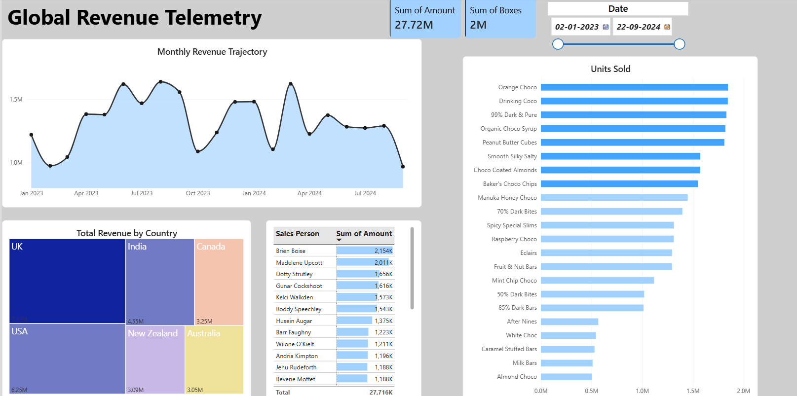

# 🌍 Global FMCG Revenue Telemetry Dashboard

## 🏢 Business Objective
The goal of this project was to establish a high-level semantic model to track global FMCG (Fast-Moving Consumer Goods) sales dynamics. Management required a unified tracking interface to monitor $27.72M in generated revenue across multiple international vectors and product lines.

---

## 📈 Key Performance Indicators (KPIs)
The dashboard operates on a dynamic date slicer (Jan 2023 – Sep 2024), powering the following macro-level metrics:
* **Gross Revenue Output:** $27.72M aggregate volume tracked across the selected time series.
* **Volume Metric:** 2M total product boxes deployed.

---

## 📊 Visual Architecture & Business Logic

### 1. Temporal & Geographic Distribution
* **Monthly Revenue Trajectory:** A continuous time-series line chart tracking cyclical revenue spikes, notably highlighting the major Q3/Q4 demand surges.
* **Geographic Density (Treemap):** A proportional mapping of market share, isolating the UK ($7.52M) and the USA ($6.25M) as the dominant revenue hubs, guiding future localized marketing spend.

### 2. Product & Workforce Velocity
* **Sales Vector Matrix:** A performance grid identifying top-tier representatives (e.g., Brien Boise driving $2,154K) using integrated data bars for instant visual ranking.
* **Product Performance Array:** A horizontal bar architecture isolating the highest-converting SKUs, led by "Orange Choco" and "Drinking Coco," which dictate inventory replenishment priorities.

---

## 🖼️ Executive UI Presentation

---
